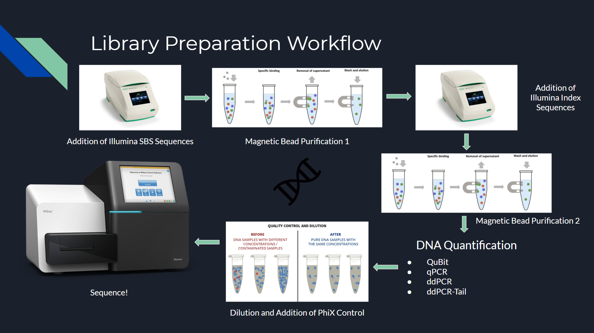

# In Depth Look at Next Generation Sequencing

### Library Preparation

The library preparation step of next generation sequencing is essential for a successful next generation seqeuncing run. These intial steps ensure that issues with the quality of the sequencing reads and purity of the DNA samples do not affect the results of the run as well as making sure Illumina's sequencing analysis algorithms are able to perform downstream without issues. In this section, we will take a closer look at all the steps involved in a standard Illumina next generation sequencing library preparation. 

### Workflow

This image describes a general view of the NGS library preparation workflow. It includes:
- The addition of Illumina's sequencing by synthesis adaptors
- A first magnetic bead purification
- The addition of Illumina's index sequences
- A second magnetic bead purification
- A DNA quantification step
- A sample dilution and addition of PhiX control
- A sequencing run
We will now take a closer look at each one of these steps

### PCR 1: Addition of SBS Adaptors

